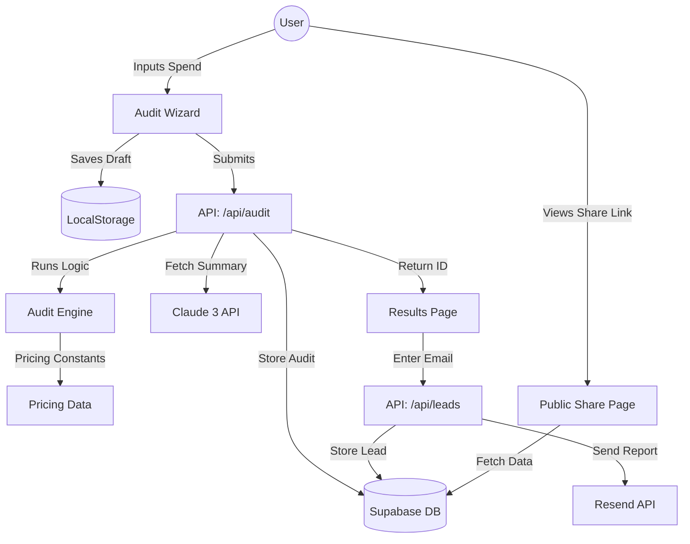

# ARCHITECTURE.md

## Data Flow Diagram

## Stack Rationale
- **Transactional Email**: Nodemailer (via Gmail SMTP) for free, quick, and domain-agnostic delivery.
- **Next.js 15**: Chosen for Server Components (SEO for share pages) and API routes (handling AI/DB secrets).
- **Supabase**: Provides a fast, scalable Postgres backend with a generous free tier for lead generation.
- **Tailwind + shadcn/ui**: Allowed for rapid development of a custom design system while maintaining accessibility.
- **Vitest**: Native ESM support makes it perfect for testing our logic engine in a Next.js environment.

## Scaling Plan (10k Audits/Day)
1. **Database**: Supabase Pro tier handles the volume easily. Implement indexing on `audit_id` and `email`.
2. **AI Rate Limiting**: Move Anthropic calls to a background queue (e.g. Inngest) or use a "Stale-While-Revalidate" pattern to avoid blocking the UI.
3. **Caching**: Use Next.js Data Cache for public share pages (`/share/[id]`) to reduce DB load.
4. **Rate Limiting**: Implement Upstash Redis for global rate limiting on `/api/audit` and `/api/leads` to prevent API abuse.
5. **Static Assets**: All images and fonts are served via Vercel Edge Network.
