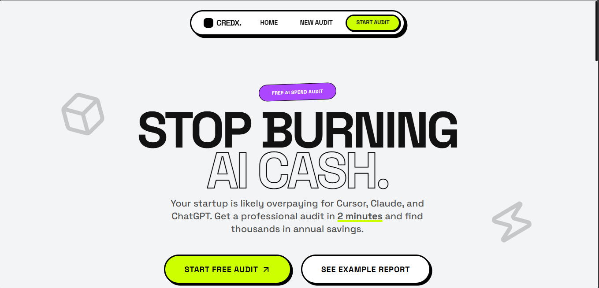

# ⚡ CredX — AI Spend Audit Tool

<div align="center">
  
  <!-- PLACEHOLDER: INSERT YOUR APP BANNER/SCREENSHOT HERE -->
  <!--  -->
  
  <div style="padding: 40px; border: 4px solid #121212; border-radius: 16px; background: #ccff00; font-weight: 900; color: #121212; margin-bottom: 24px; font-size: 1.5rem; text-transform: uppercase; box-shadow: 8px 8px 0px 0px #121212;">
    
  </div>

  <p align="center">
    <strong>A high-performance Neo-Brutalist web application built to audit startup AI spend, eliminate tool redundancies, and capture high-intent leads.</strong>
  </p>
</div>

---

## 🚀 The Big Picture

AI subscription costs are spiraling out of control. Startups routinely overpay for overlapping seats across **Cursor, Claude, ChatGPT, and GitHub Copilot** simultaneously. 

**CredX** solves this by providing a friction-free, **2-minute audit wizard** that finds thousands in annual savings. It acts as a premium lead generator for **Credex** (our core platform for bulk AI credit discounts).

---

## 🛠️ The Tech Stack

### Frontend & Core
*  — React Framework for SSR and API Routing
*  — Component-Driven UI Architecture (v19)
*  — Static Typing & Structural Type Safety
*  — Utility-First Styling

### Animation & Smooth Scrolling
*  — High-Performance Landing Animations
*  — Micro-interactions & Wizard Transitions
* **Lenis** — Smooth Cinematic Scroll Experience

### Backend, AI & Services
*  — Database Storage (Audits & Lead Entries)
*  — Sub-1s Latency AI Summaries via Gemini 1.5 Flash
* **Nodemailer** — Domain-Agnostic Transactional Email Delivery (Gmail SMTP)
* **jsPDF** — Dynamic Server-Side PDF Report Generation

### Testing & Validation
*  — Native ESM Test Runner
*  — Runtime Schema Validation

---

## ✨ Key Features

1. **3-Step Audit Wizard**: Intuitive UI flow for entering tools, plan types, seats, and use cases.
2. **Session Persistence**: Powered by a custom `useLocalStorage` hook so users don't lose progress during tab refreshes.
3. **Pure-Logic Audit Engine**: Side-effect-free math library designed for 100% test reliability.
4. **Instant AI Spend Insights**: Low-latency, contextual cost saving strategy generated via Google Gemini 1.5 Flash.
5. **PDF Report Delivery**: Dynamic PDF generation containing personalized breakdowns, emailed directly via SMTP.
6. **Social Sharing Engine**: Secure public share URLs using non-predictable `nanoid` (12 chars) with dynamic Open Graph (OG) social card rendering.

---

## ⚡ Quick Start

### 1. Clone & Install
```bash
git clone https://github.com/syedaftab-dev/credex.git
cd credex
npm install
```

### 2. Configure Environment Variables
Copy `.env.example` to `.env.local` and populate the keys:
```bash
cp .env.example .env.local
```
Key requirements:
- `NEXT_PUBLIC_APP_URL`: base URL (e.g., `http://localhost:3000`)
- `GOOGLE_AI_API_KEY`: API Key from Google AI Studio
- `NEXT_PUBLIC_SUPABASE_URL` & `NEXT_PUBLIC_SUPABASE_ANON_KEY`
- `SUPABASE_SERVICE_ROLE_KEY`: bypasses RLS for admin operations
- `EMAIL_USER` & `EMAIL_PASS`: Gmail credentials for SMTP routing

### 3. Run Development Server
```bash
npm run dev
```

### 4. Run Test Suite
```bash
npx vitest run
```

---

## 🏗️ System Architecture

Our data flow prioritizes performance and reliability, utilizing serverless API routes to keep client bundles lightweight:

```
[User Input] ──> [Audit Wizard] ── (Persists Draft) ──> [LocalStorage]
                      │
                 (Submits Form)
                      ▼
               [POST /api/audit] ──> [Audit Engine (Pricing Data)]
                      │
                      ├─(Fetches Summary)──> [Gemini API]
                      ├─(Stores Record)───> [Supabase DB]
                      ▼
               [Return Audit ID] ──> [Results Dashboard]
                                            │
                                     (Submits Lead Email)
                                            ▼
                                     [POST /api/leads]
                                            │
                                            ├─(Saves Lead)───────> [Supabase DB]
                                            └─(Generates PDF/Send)─> [Nodemailer SMTP]
```

For a detailed scaling plan, see [ARCHITECTURE.md](file:///e:/Projects/credex/ARCHITECTURE.md).

---

## 📐 Key Design Decisions

1. **Neo-Brutalist Design Tokens**: High-contrast, chunky layouts, drop-shadows, and heavy borders to stand out in the crowded B2B SaaS landscape and convey an honest, direct voice.
2. **Excluding Free Tiers in Recommendations**: To keep audits practical for startups, the engine compares paid tiers to paid tiers only, omitting $0 plans if the user is on a paid plan.
3. **Gemini over Claude for Summaries**: Migrated summary generation to Gemini 1.5 Flash to achieve sub-1s load times on the results page.
4. **Honeypot Verification**: Implemented zero-friction honeypot fields to filter automated bot leads without annoying human users with CAPTCHAs.
5. **Separation of Concerns**: Extracted the core calculator into a pure function `runAudit` to ensure rapid test runs.
